# How  to deploy a Machine Learning Model WebApp on AWS Cloud SageMaker Notebook

Sometimes when you need to deploying **machine learning models** in **production** and **graphics-intensive applications** and you have not enough power computing to satisfy your needs. Then you can use the following blog post to solve this issue. Instead of upgrade your  cluster of your company or personal computer, you can use the cloud. 

With **Amazon Web Services** you can simply  create an instance with the adequate requirements for your Web Application .

In this blog post I will show how to create a web application on **AWS SageMaker** Notebook and connect with from your computer.

In particular we will create an application that will create a **video from a text** by using one of the amazing techniques to generation of images from a text by using **DALL-E**.

I

The video that I am interested to create is about the **The Hare & the Tortoise** and the  **Selfish Giant**, I am going to create a WebApplication that will create from the text a video story based on the experienced that the machine learning model has.


The model that I will consider is the **DALL-E**  , it is machine learning models developed by OpenAI to generate digital images from  natural language descriptions.  Let me mention that there is now a new  version called **DALL-E 2**   which is designed  to generate more realistic images at higher resolutions that "can combine concepts, attributes, and styles


**DALLE -2** Generated this image when given the prompt "Teddy bears working on new AI research underwater with 1990s technology".

(Picture from Wikipedia)

## Architecture

AWS does not natively support SSH-ing into **SageMaker notebook instances**, but nothing really prevents you from setting up SSH yourself.

There are two  possible solutions to connect :

a) **Reverse proxy**

b) **Bastion box.**  

In a previous blog post we have discussed the [ How to connect to Sagemaker via SSH](https://ruslanmv.com/blog/How-to-connect-to-Sagemaker-Notebook-via-SSH), which is based on the **Bastion box**. This is useful when you want to control all the pieces of your Cloud Infrastructure. In this new blog post we focus in a more simpler solution that is given by the **Reverse proxy.**

# Reverse proxy Solution

A **reverse proxy** is a type of proxy server.  Unlike a traditional proxy server, which is used to protect clients, a reverse proxy is used to protect servers. A reverse proxy is a server that accepts a request from a client, forwards the request to another one of many other servers, and returns the results from the server that actually processed the request to the client as if the proxy server had processed the request itself. The client only communicates directly with the reverse proxy server and it does not know that some other server actually processed its request.

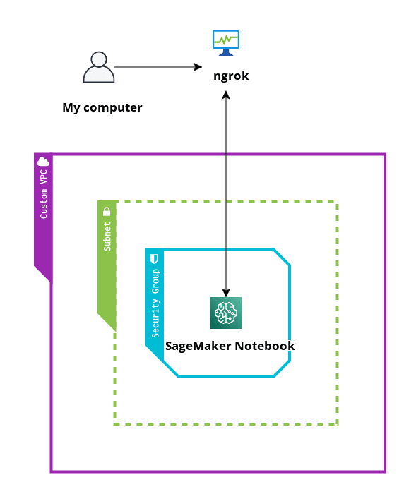

Due to **AWS Sagemaker** notebook officially does not support **ssh** support natively and we want to connect from our Laptop to our Sagemaker Server. We are going to a use a simply application called  **ngrok**  that will allow us connect it to our server.

## Step 1 - Creation of ngrok Account


FIrst create account on [https://ngrok.com/signup]( https://ngrok.com/signup)

[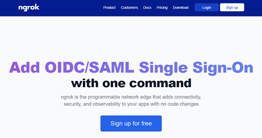]( https://ngrok.com/signup)

after you created your account  and confirm your email, you can copy the Authtoken

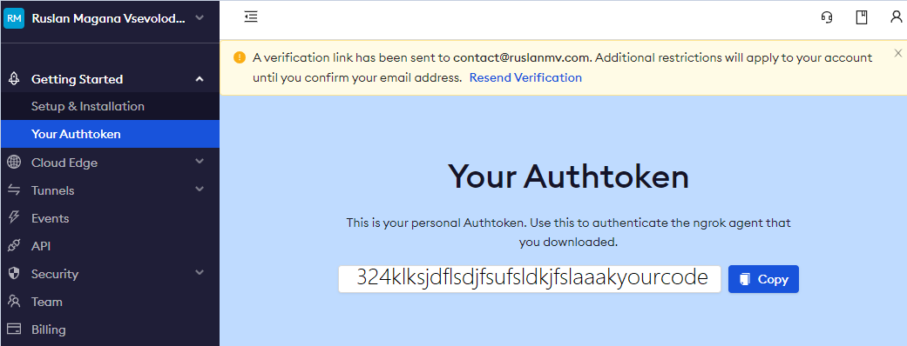

you will use this Token to get the URL site of your web applications.

## Step 2- Creation of Security Group for SageMaker


In ordering to communicate with Sagemaker Notebook Instance we need create a custom  **Security Groups**.

Head to the [AWS Console](https://aws.amazon.com/console/) and from there, under  All Services, choose **EC2**, open a new tab

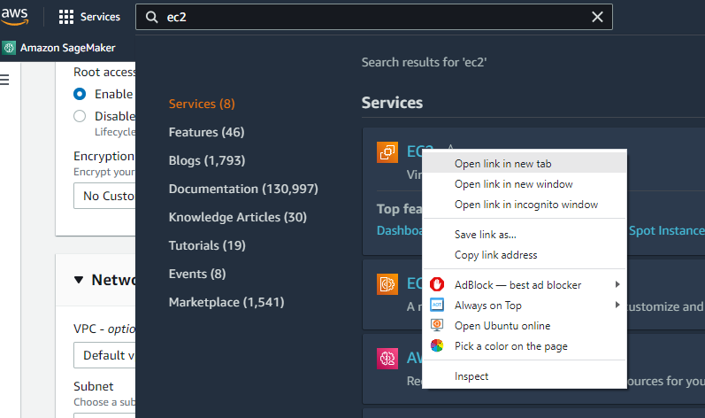

in the new window , click **Security Groups**

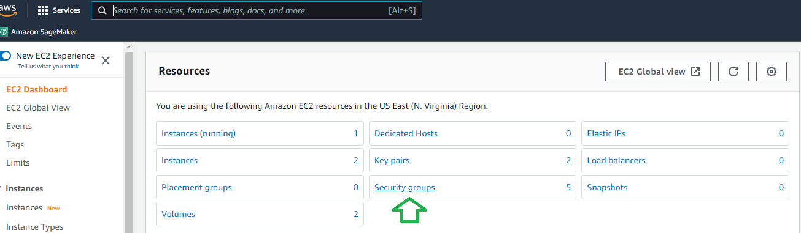

and then **Create Security Group**. Give it a name, such as **SageMaker-Security**, and then create an SSH rule to only allow the my IP in the inboud


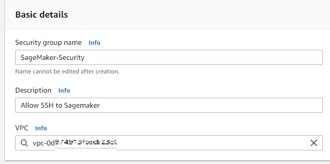

and outbout **Anywhere**

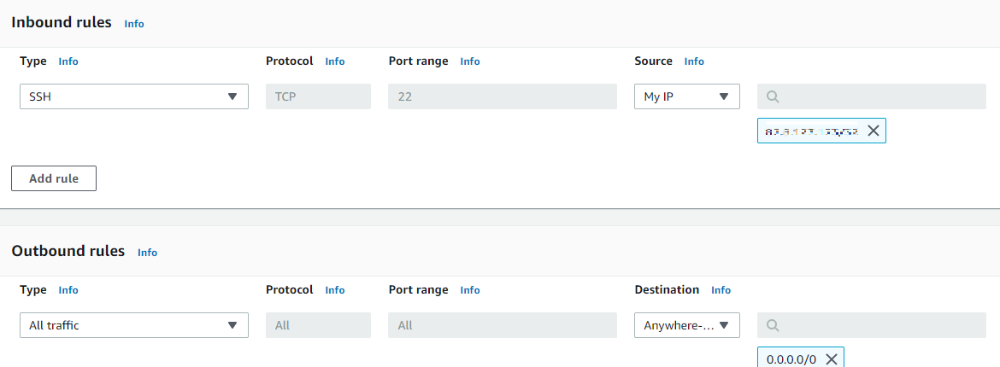

once was created we can continue to create a new SageMaker notebook.


### Step 3 - Creation of SageMaker Notebook

Head to the [AWS Console](https://aws.amazon.com/console/) and from there, under  All Services, choose **SageMaker**. 

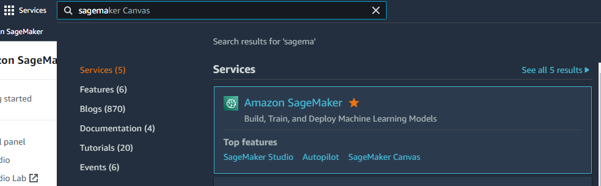


In Sagemaker we will choose the Notebook instances, click **create a notebook instance**

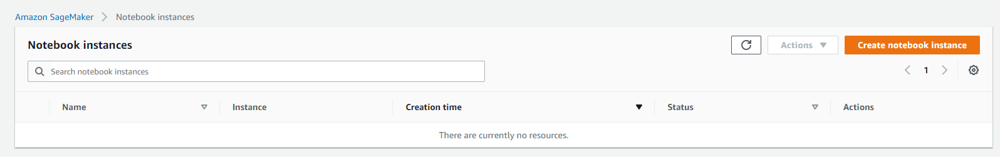


then we name our server as **Sagemaker** . There are a vast of types of AWS Instaces, for our GPU consuming   I suggest use the Amazon EC2 G4 instances that  provide the latest generation **NVIDIA T4 GPUs**.

Moreover **Amazon EC2 G4 instances** deliver a cost-effective GPU instance for deploying machine learning models in production and graphics-intensive applications. 

These instances deliver up to 65 TFLOPs of FP16 performance to accelerate machine learning inference applications and ray-tracing cores to accelerate graphics workloads such as graphics workstations, video transcoding, and game streaming in the cloud.


**You should be careful,** choose the appropriate instance, to avoid extra costs!!!

| Accelerated Computing | vCPU | Memory  | Price per Hour |
| :-------------------: | :--: | :-----: | :------------: |
|     ml.p3.2xlarge     |  8   | 61 GiB  |     $3.825     |
|     ml.p3.8xlarge     |  32  | 244 GiB |    $14.688     |
|    ml.p3.16xlarge     |  64  | 488 GiB |    $28.152     |
|    ml.g4dn.xlarge     |  4   | 16 GiB  |    $0.7364     |

In particular this instance **ml.g4dn.xlarge**   , during the writing time, you will pay **$0.7364 per Hour** so  be sure to delete your Instance after you finish.


In the **Notebook instance settings**, we name the instance as **Sagemaker** and Notebook Instance

  **ml.g4dn.xlarge** which has the following specs: 1 GPU, 4 vCPUs, 16 GiB of memory, 125 NVMe SSD, up to 25 Gbps network performance

in addition, we need to add  an extra **Volume Size** of the instance, for this project we choose **30gb**

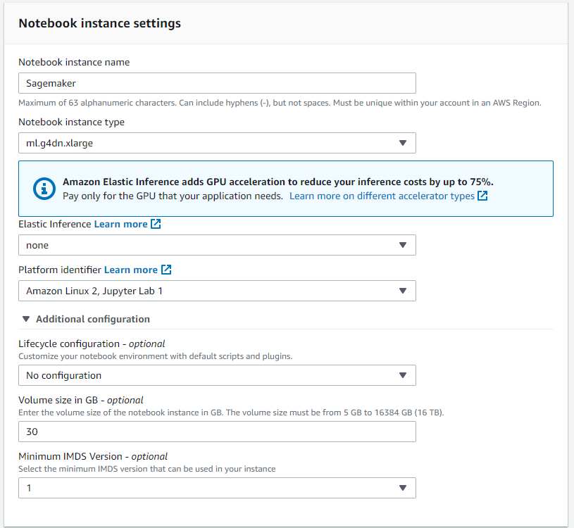

 In the **Network section**, we choose our **Default VPC** and we choose the first subnet that you can see then, in the Security Group we select **SageMaker-Security** 

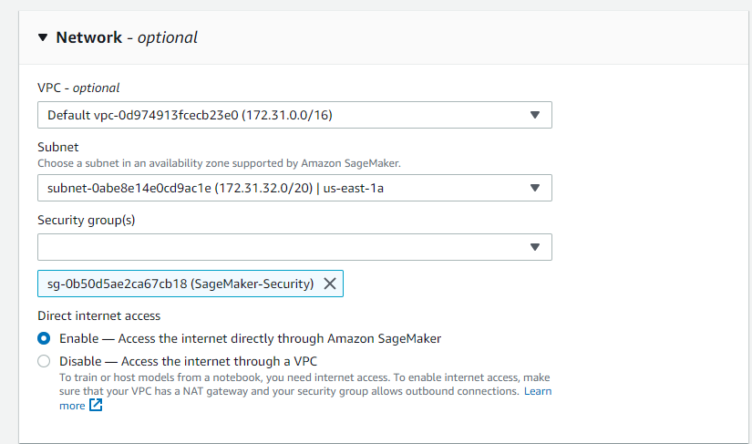

and finally **create the notebook instance** and we wait until the Status changes from Pending to InService.

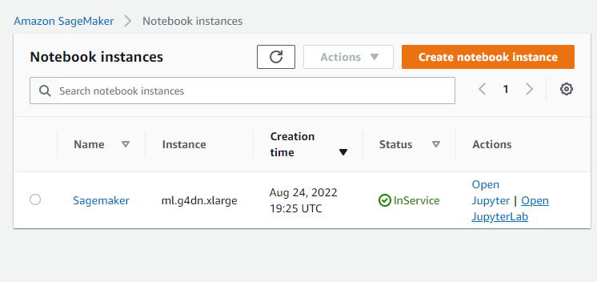


## Step 3 - Setup Sagemaker Notebook

Click **Open Jupyter Lab**  and  click **File** > **New**>**Terminal**

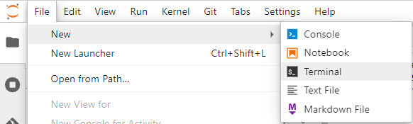


then in the terminal type

```
source activate python3
```

and there you can  type

```
conda info --envs
```

to see all your possible enviroments by defult given in SageMaker

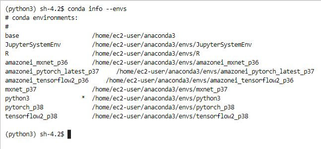

For this project, we are going to use  `pytorch_p38`

```
conda activate pytorch_p38
```

```
conda install -n base -c conda-forge jupyterlab_widgets
```

and we install pyngrok  to get the reverse proxy  and gradio to test the enviroment

```
pip install pyngrok gradio
```

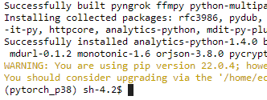


## Step 4 - Setup pyngrok

Let us open a new notebook 

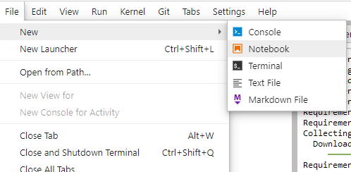


and we select the kernel  **pytorch_p38**

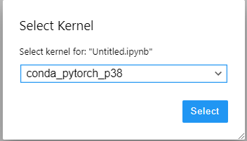


and we copy the following code

For the first time copy this code

```python
#Setup of your token for first time
import sys, IPython
from pyngrok import ngrok
YOUR_TOKEN="2DrXaskdhakjsdhkashjdkadjshdkashg8m8uf1R4gPZiTrDzY2"
ngrok.set_auth_token(YOUR_TOKEN)
IPython.Application.instance().kernel.do_shutdown(True)
```

now the token

```python
# If is installed the token you can use this code
import sys, IPython
from pyngrok import ngrok
from IPython.core.display import display, HTML
# Open a HTTP tunnel on port 8089
# <NgrokTunnel: "http://<public_sub>.ngrok.io" -> "http://localhost:8089">
http_tunnel = ngrok.connect(8089, bind_tls=True)
http_url = http_tunnel.public_url
display(HTML(f'<b><a target="blank" href="{http_url}">Load test: {http_url}</a></b>'))
```

You will have something similar like:

**[Load test: https://1ce4-34-236-55-223.ngrok.io](https://1ce4-34-236-55-223.ngrok.io/)**

```python
# Open a SSH tunnel
# <NgrokTunnel: "tcp://0.tcp.ngrok.io:12345" -> "localhost:22">
ssh_tunnel = ngrok.connect(22, "tcp")
display(HTML(f'<b><a target="blank" href="{ssh_tunnel}">SSH test: {ssh_tunnel}</a></b>'))
```

You will have something similar like:

**["localhost:22"">SSH test: NgrokTunnel: "tcp://8.tcp.ngrok.io:12995" -> "localhost:22"](ngroktunnel:)**

you can see your status

```python
tunnels = ngrok.get_tunnels()
print(tunnels)
```

```
[<NgrokTunnel: "https://1ce4-34-236-55-223.ngrok.io" -> "http://localhost:8089">, <NgrokTunnel: "tcp://8.tcp.ngrok.io:12995" -> "localhost:22">]
```


## Step 5 Testing Environment

once you have recieved the url of your server ngrok, you can run this following cell

```python
def test():
    import gradio as gr
    def greet(name):
      return "Hello " + name + "!"
    iface = gr.Interface(fn=greet, inputs="text", outputs="text")
    iface.launch(server_port=8089)
```

then

```
test()
```

After is running this  open your webrowser , for example edge

**[https://1ce4-34-236-55-223.ngrok.io](https://1ce4-34-236-55-223.ngrok.io/)**

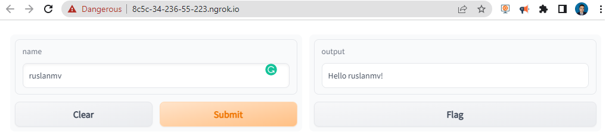Dont worry if Chrome says: Deceptive site ahead Attackers on **8c5c-34-236-55-223.ngrok.io** may trick you into doing something dangerous You click visit this site.

Somehow Chrome marked ngrok.io like a dangerous, to avoid this type of issues you can select another method to log into SageMaker,  like I have done in previous blog  [ How to connect to Sagemaker via SSH](https://ruslanmv.com/blog/How-to-connect-to-Sagemaker-Notebook-via-SSH)

After you have used you app you can close everything

```python
print(" Shutting down server.")
ngrok.kill()
gr.close_all()
```

## Ngrok in the terminal (optional)

```
ngrok authtoken 2DrXaskdhakjsdhkashjdkadjshdkashg8m8uf1R4gPZiTrDzY2
```

```
ngrok http 8089
```

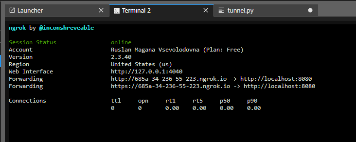


# Text to Video - Dalle

To install the Python packages in the correct Conda environment, first activate the environment before running **pip install** or **conda install** from the terminal.

```
sh-4.2$ source activate python3
```

To activate any conda environment, run the following command in the terminal.

```
(python3) sh-4.2$ conda activate pytorch_p38
```

When you run this command, any packages installed using conda or pip are installed in the environment.

In addition we need

```
conda install ffmpeg -c conda-forge -y
```

and finally we clone the following repository 

```
git clone https://github.com/ruslanmv/Text-to-Video-Story.git
```

```
cd Text-to-Video-Story/gradio
```

```
pip install -r requirements.txt
```

you will obtain something like


after all the requirements well installed.
