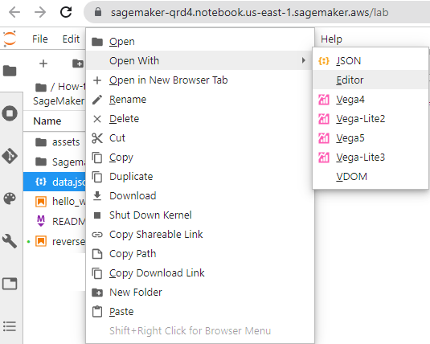
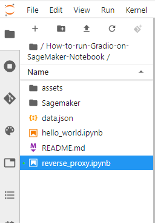

# How  to deploy a Machine Learning Model WebApp on AWS Cloud SageMaker Notebook

Sometimes when you need to deploying **machine learning models** in **production** and **graphics-intensive applications** and you have not enough power computing to satisfy your needs. Then you can use the following blog post to solve this issue. Instead of upgrade your  cluster of your company or personal computer, you can use the cloud. 

With **Amazon Web Services** you can simply  create an instance with the adequate requirements for your Web Application .

In this blog post I will show how to create a web application on **AWS SageMaker** Notebook and connect with from your computer.

In particular we will create an application that will create a **video from a text** by using one of the amazing techniques to generation of images from a text by using **DALL-E**.

The video that I am interested to create is about the **The Hare & the Tortoise** and the  **Selfish Giant**, I am going to create a WebApplication that will create from the text a video story based on the experienced that the machine learning model has.


The model that I will consider is the **DALL-E**  , it is machine learning models developed by OpenAI to generate digital images from  natural language descriptions.  Let me mention that there is now a new  version called **DALL-E 2**   which is designed  to generate more realistic images at higher resolutions that "can combine concepts, attributes, and styles


**DALLE -2** Generated this image when given the prompt "Teddy bears working on new AI research underwater with 1990s technology".

(Picture from Wikipedia)

## Architecture

AWS does not natively support SSH-ing into **SageMaker notebook instances**, but nothing really prevents you from setting up SSH yourself.

There are two  possible solutions to connect :

a) **Reverse proxy**

b) **Bastion box.**  

In a previous blog post we have discussed the [ How to connect to Sagemaker via SSH](https://ruslanmv.com/blog/How-to-connect-to-Sagemaker-Notebook-via-SSH), which is based on the **Bastion box**. This is useful when you want to control all the pieces of your Cloud Infrastructure. In this new blog post we focus in a more simpler solution that is given by the **Reverse proxy.**

# Reverse proxy Solution

A **reverse proxy** is a type of proxy server.  Unlike a traditional proxy server, which is used to protect clients, a reverse proxy is used to protect servers. A reverse proxy is a server that accepts a request from a client, forwards the request to another one of many other servers, and returns the results from the server that actually processed the request to the client as if the proxy server had processed the request itself. The client only communicates directly with the reverse proxy server and it does not know that some other server actually processed its request.


Due to **AWS Sagemaker** notebook officially does not support **ssh** support natively and we want to connect from our Laptop to our Sagemaker Server. We are going to a use a simply application called  **ngrok**  that will allow us connect it to our server.

## Step 1 - Creation of ngrok Account


First create account on [https://ngrok.com/signup]( https://ngrok.com/signup)

[]( https://ngrok.com/signup)

after you created your account  and confirm your email, you can copy the **Authtoken**


you will use this Token to get the URL site of your web applications.

## Step 2- Creation of Security Group for SageMaker

In ordering to communicate with Sagemaker Notebook Instance we need create a custom  **Security Groups**.

Head to the [AWS Console](https://aws.amazon.com/console/) and from there, under  All Services, choose **EC2**, open a new tab


in the new window , click **Security Groups**


and then **Create Security Group**. Give it a name, such as **SageMaker-Security**, and then create an SSH rule to only allow the my IP in the inboud


and outbout **Anywhere**


once was created we can continue to create a new SageMaker notebook.

### Step 3 - Creation of SageMaker Notebook

Head to the [AWS Console](https://aws.amazon.com/console/) and from there, under  All Services, choose **SageMaker**. 


In Sagemaker we will choose the Notebook instances, click **create a notebook instance**


then we name our server as **Sagemaker** . There are a vast of types of AWS Instaces, for our GPU consuming   


Due to our WebApp requires more than **16 GPU Memory (GiB)** we will  choose the ml.g5 instances.

**You should be careful,** choose the appropriate instance, to avoid extra costs!!!

| Accelerated Computing | vCPU | Memory  | Price per Hour | **GPU Memory (GiB)** |
| :-------------------: | :--: | :-----: | :------------: | -------------------- |
|     ml.g5.xlarge      |  4   | 16 GiB  |     $1.41      | 24                   |
|     ml.p3.8xlarge     |  32  | 244 GiB |    $14.688     | 64                   |
|  **ml.g5.12xlarge**   |  48  | 192 GiB |   **$7.09**    | 96                   |

In particular this instance **ml.g5.12xlarge** , during the writing time, you will pay **$7.09 per Hour** so  be sure to delete your Instance after you finish!!!.

In the **Notebook instance settings**, we name the instance as **Sagemaker** and Notebook Instance **ml.g5.12xlarge**  we need to add  an extra **Volume Size** of the instance, for this project we choose **30gb**.


 In the **Network section**, we choose our **Default VPC** and we choose the first subnet that you can see then, in the Security Group we select **SageMaker-Security** 


and finally **create the notebook instance** and we wait until the Status changes from **Pending** to **InService.**


## Step 3 - Setup Sagemaker Notebook

Click **Open Jupyter Lab**  and  click **File** > **New**>**Terminal**


To install the Python packages in the correct Conda environment, first activate the environment before running **pip install** or **conda install** from the terminal.

```
source activate python3
```

and there you can  type

```
conda info --envs
```

as you see , in **SageMaker** you have different environments ready to work,


for this project, we are going to use  `pytorch_p38`

```
conda activate pytorch_p38
```

Let us install **pyngrok**  to get the reverse proxy  and **gradio** to test the environment

```
pip install pyngrok gradio
```


### Step 4 - Download the project

For this project we are interested to run a **WebApp** that will convert **Text to Video**. 

First enter to **SageMaker** folder

```
cd SageMaker
```

then

```
git clone https://github.com/ruslanmv/How-to-run-Gradio-on-SageMaker-Notebook.git
```

```
cd How-to-run-Gradio-on-SageMaker-Notebook
```

```
cd Sagemaker
```

```
pip install -r requirements.txt
```

you will obtain something like


after all the requirements well installed.

## Step 4 - Setup pyngrok

Then select **data.json**, open with and editor




and paste your token between the " "  , for example

```
{
    "token": "2DwxLpbhkJVZ2UdJ2Ls0p8tlxTB_6oshozHRwcgL3Z2KtUz11"
}
```

Let us open a the **reverse_proxy.ipynb** notebook




be sure that you are using the kernel  **pytorch_p38** 


then for the notetbook r**everse_proxy** run the fill cell

```python
#Setup of your token for first time
import sys, IPython
from pyngrok import ngrok
import json 
# Opening JSON file
f = open('data.json')
# returns JSON object as 
# a dictionary
data = json.load(f)
#print(data)
YOUR_TOKEN=data['token']
ngrok.set_auth_token(YOUR_TOKEN)
IPython.Application.instance().kernel.do_shutdown(True)
```

if you see

```
{'status': 'ok', 'restart': True}
```

means that was done well the authentication, then run the next cells

```python
# If is installed the token you can use this code
import sys, IPython
from pyngrok import ngrok
from IPython.core.display import display, HTML
# Open a HTTP tunnel on port 7860
# <NgrokTunnel: "http://<public_sub>.ngrok.io" -> "http://localhost:7860">
http_tunnel = ngrok.connect(7860, bind_tls=True)
http_url = http_tunnel.public_url
display(HTML(f'<b><a target="blank" href="{http_url}">Load test: {http_url}</a></b>'))
```

You will have something similar like:

**[Load test: https://944e-34-236-55-223.ngrok.io](https://944e-34-236-55-223.ngrok.io/)**

```python
# Open a SSH tunnel
# <NgrokTunnel: "tcp://0.tcp.ngrok.io:12345" -> "localhost:22">
ssh_tunnel = ngrok.connect(22, "tcp")
display(HTML(f'<b><a target="blank" href="{ssh_tunnel}">SSH test: {ssh_tunnel}</a></b>'))
```

You will have something similar like:

**["localhost:22"">SSH test: NgrokTunnel: "tcp://2.tcp.ngrok.io:14454" -> "localhost:22"](ngroktunnel:)**

you can see your status

```python
tunnels = ngrok.get_tunnels()
print(tunnels)
```

and the output is

```
[<NgrokTunnel: "https://a5c3-34-236-55-223.ngrok.io" -> "http://localhost:7860">, <NgrokTunnel: "tcp://4.tcp.ngrok.io:10753" -> "localhost:22">]
```

Now we are ready to test our enviroment.

## Step 5 Testing Environment

Select the  **hello_world.ipynb** 


and run the following cell

```python
import gradio as gr
def test(): 
    def greet(name):
      return "Hello " + name + "!"
    iface = gr.Interface(fn=greet, inputs="text", outputs="text")
    iface.launch(server_port=7860)
```

then

```
test()
```

After is running this  return back to your **reverse_proxy** notebook and click the link

**[Load test: https://944e-34-236-55-223.ngrok.io](https://944e-34-236-55-223.ngrok.io/)**

then click **Visit Site**

 

and type your name for example,

Don't worry if  If Chrome says: Deceptive site ahead Attackers ... dont worry. You click visit this site.

Alternative way to avoid this type of issues you can select another method to log into SageMaker,  like in previous blog  [ How to connect to Sagemaker via SSH](https://ruslanmv.com/blog/How-to-connect-to-Sagemaker-Notebook-via-SSH).

If your you **pass the test**, then 

you can close Gradio

```python
msg = 'Would you like stop gradio server?'
shall = input("%s (y/N) " % msg).lower() == 'y'
if shall == True:
    print(" Shutting down gradio server.")
    gr.close_all()
```

by pressing y

```
Would you like stop gradio server? (y/N)  y
 Shutting down gradio server.
Closing server running on port: 7860
```

For complementary you can use also the terminal to use ngrok, but we wont use for this project (dont run now)

```
ngrok authtoken YOUR_TOKEN_HERE
```

and

```
ngrok http 8089
```


when you click ctrl+c, the server is stoped.


# Creation of Awesome Video Story - Text to Video 

Finally  we have built all the Infrastructure in the cloud needed to create our amazing video story.

Go to your **Sagemaker** folder of the repo and open **video_story_creator_gradio.ipynb**


Then  run the first cell

```python
# Step 2 - Importing Libraries
from moviepy.editor import *
from PIL import Image
from transformers import AutoTokenizer, AutoModelForSeq2SeqLM,pipeline
import gradio as gr
import torch
from huggingface_hub import snapshot_download
from PIL import Image
from min_dalle import MinDalle
import torch
from PIL import Image, ImageDraw, ImageFont
import textwrap
from mutagen.mp3 import MP3
# to speech conversion
from gtts import gTTS
from pydub import AudioSegment
from os import getcwd
import glob
import nltk
import subprocess
nltk.download('punkt')
description = " Video Story Generator with Audio \n PS:  Generation of video by using Artifical Intellingence by dalle-mini and distilbart and gtss "
title = "Video Story Generator with Audio by using dalle-mini and distilbart and gtss  "
tokenizer = AutoTokenizer.from_pretrained("sshleifer/distilbart-cnn-12-6")
model = AutoModelForSeq2SeqLM.from_pretrained("sshleifer/distilbart-cnn-12-6")
```

and then

```python
# Analsis of GPU usage
def log_gpu_memory():
    print(subprocess.check_output('nvidia-smi').decode('utf-8'))
device = torch.device("cuda:0" if torch.cuda.is_available() else "cpu")
print(device)
use_gpu = True if torch.cuda.is_available() else False
if use_gpu == True : log_gpu_memory() 
#transfer model
#model.to(device)
```


You can see that we have a Great **NVIDIA A10G** GPU.

Run the next shell


then return back to your previous link and refresh

**[Load test: https://a5c3-34-236-55-223.ngrok.io](https://a5c3-34-236-55-223.ngrok.io/)**

you will have


when you click **Generate Video**, to test our **WebApp**, in your notebook you can see the progress
